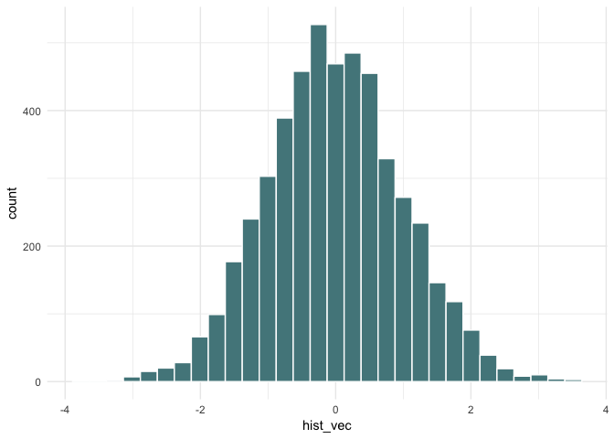
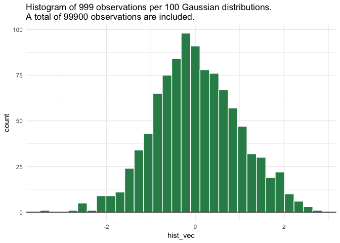

# General Programming in R: Solutions
Rob Chavez  
4/18/2018  

## Solutions for week 1 assigment

As I've said in class, there are many ways to accomplish the same goal in R, and everyone did things a bit differently. Here is what I came up with for this assignment. 


# Minihacks

## Minihack 1: For loop

1. Write a for loop simulating the normal distribution. Draw 5000 samples of one random observation at a time from a normal curve and plot them in a histogram.  


```r
library(ggplot2)

# create empty vector
hist_vec <- vector() 

# run for loop to populate the empty vector
for(i in 1:5000){
  hist_vec[i] <- rnorm(1)
}

# plot
qplot(hist_vec) + 
  geom_histogram(fill='cadetblue4',color='white') + 
  theme_minimal()
```

```
## `stat_bin()` using `bins = 30`. Pick better value with `binwidth`.
## `stat_bin()` using `bins = 30`. Pick better value with `binwidth`.
```

<!-- -->


## Minihack 2: Functions  

1. Use the `for` loop you created to simulate a normal distribution and turn it into a function that takes the following as inputs:  
- number of observations in the normal distribution being sampled  
- number of distributions sampled from  

The function should also generate a histogram with title. Run your function with any values you want.  

\
Here is a version function that accomplishes this.

```r
hist_normal <- function(obs, dists){
  hist_vec <- vector()
  
  for(i in length(dists)){
    samples <- rnorm(obs)
    hist_vec <- c(hist_vec, samples)
  }
  
 p <-  qplot(hist_vec) + 
    geom_histogram(fill='seagreen4',color='white') +
    ggtitle(paste("Histogram of", obs, "observations per", dists, "Gaussian distributions. \nA total of",obs*dists,"observations are included.")) +
    geom_hline(yintercept = 0) +
    theme_minimal() 
  return(p)
}

hist_normal(999,100)
```

```
## `stat_bin()` using `bins = 30`. Pick better value with `binwidth`.
## `stat_bin()` using `bins = 30`. Pick better value with `binwidth`.
```

<!-- -->


2. Write a function to calculate standard error of the mean for the "population", "life expectancy" and "GDP Per Capita" variables in the gapminder dataset. Remember the formula for standard error:

$$ SEM = \sqrt{\sigma^2/n} $$
Below is my function for calculating a standard error. Additionally, it has an option for ignoring missing cases. This is nice because it will let you know if you have NAs by returning an NA, but gives you the option to ignore them if you want.  

```r
# define standard error function
se_calc <- function (x, na.rm = FALSE){
    if (na.rm == TRUE){ 
    x <- x[!is.na(x)]
    }
    sd(x)/sqrt(length(x))
}
```

\
\
Here are some examples:

```r
library(gapminder)

# gaminder data 
gap_pop <- se_calc(gapminder$pop)
gap_life <- se_calc(gapminder$lifeExp)
gap_gdp <- se_calc(gapminder$gdpPercap)

# print in a nicely formatted tables
gap_df <- data.frame(gap_pop, gap_life, gap_gdp)
knitr::kable(gap_df, digits = 2)
```


 gap_pop   gap_life   gap_gdp
--------  ---------  --------
 2571683       0.31     238.8

```r
# gamminder 'pop' with missing data
missing_pop <- gapminder$pop
missing_pop[1] <- NA

se_calc(missing_pop)  # don't allow missing data
```

```
## [1] NA
```

```r
se_calc(missing_pop, na.rm = TRUE)  # allow missing data
```

```
## [1] 2573164
```

\
\
You can also use this function accross several variables with the apply family of commands.

```r
# using se_calc with the apply family functions
my_list <- list(gapminder$pop, gapminder$lifeExp, gapminder$gdpPercap)

lapply(my_list, se_calc)  # print in list
```

```
## [[1]]
## [1] 2571683
## 
## [[2]]
## [1] 0.3129179
## 
## [[3]]
## [1] 238.7976
```

```r
sapply(my_list, se_calc)  # print in numeric vector
```

```
## [1] 2.571683e+06 3.129179e-01 2.387976e+02
```

## Minihack 3: Exporting data

1. Using the taco data, write a function or for loop to:  
    - Create an output folder called `output` in each subject's directory
    - Subset the updated data frame by subject, and 
    - Export each subject's data frame back to their own subject directory as a new csv file with a different name
\
\
The chunk below will get the data modified from Krista and Brendan's code for use in the example.   

```r
# Set working directory
working_dir <-  "C:/Users/rober/Desktop/2018_dataSciSem/" 

# Paths
data_dir <- paste0(working_dir, "data/") 

# Variables
sub_pattern <-  "sub[0-9]{2}" 

# Get subjects list
subjects <- list.files(data_dir, pattern = sub_pattern)

# get 'dat' data frame 
create_df <- function(subjects) {
    df <- data.frame()  # make an empty data frame
    for(sub in subjects) {
        data_file <- list.files(paste0(data_dir, sub), pattern = "*.csv", full.names = TRUE) 
        df_tmp <- read.csv(data_file, sep = ",")  # read in the data
        df_tmp$id <- rep(as.character(sub), nrow(df_tmp))  # make a column for the subject ID based
        df <- rbind(df, df_tmp)  # add the subject's data to the main data frame
    }
    dat <<- df
}

create_df(subjects = subjects)
```

The code below is how you do this using a for loop.

```r
library(dplyr)

# run loop
for(sub in subjects) {
  
    data_dir <- "C:/Users/rober/Desktop/2018_dataSciSem/data/" 
    
  # created folders
    output_file <- paste0(data_dir, sub, "/output_loop")
    dir.create(output_file)
    
  # subset by subject
    new_dat <- filter(dat, id == sub)
    
    #Export the file (each file named suboutput.csv)
    output_path <- paste0(output_file, "/suboutput.csv")
    
    #create the csv
    write.csv(new_dat, output_path)

}
```

Here is how you can adapt the same loop into a function. This is useful for situations where you might want to use the same code multiple times. 

```r
# define function
create_output <- function(subjects) {
  
  data_dir <- "C:/Users/rober/Desktop/2018_dataSciSem/data/"
  
    for (sub in subjects) {
      
      # created folders
        output_file <- paste0(data_dir,sub,"/output_function")
        dir.create(output_file)
        
      # subset by subject
        new_dat <- filter(dat, id == sub)
        
        #Export the file (each file named suboutput.csv)
        output_path <- paste0(output_file, "/suboutput.csv")
        
        #create the csv
        write.csv(new_dat, output_path)
    }
}

# run function
create_output(subjects)
```


## Minihack 4: Coding with style

1. Go check out the [style guide](http://adv-r.had.co.nz/Style.html), or optionally, the more in depth [Google R Style Guide](https://google.github.io/styleguide/Rguide.xml) Then, activate RStudio's [linter](https://en.wikipedia.org/wiki/Lint_(software)) by going to `RStudio > Preferences > Code > Diagnostics` and checking all the boxes. Click "OK." Once that's done, go back through the code you've written for the minihack blocks, check for any issues, and correct them. You may need to save your file or start typing some code before the linter will activate. (Also, the linter is still a little buggy. If there's an indicator that says a variable has not yet been assigned, it may be that it was assigned in a different code block. Use your judgment.)    


**I break several guidelines, and that's okay. For example, I do not put spaces between 'for' calls and their parentheses (and I have no plans to change this).**

## Final words

Great job, everyone. There were lots of interesting ways to use the code that I would have never thought of. Hopefully you found my comments on your code in canvas helpful. Let me know if you have questions that come up along the way.

-- Rob


\
