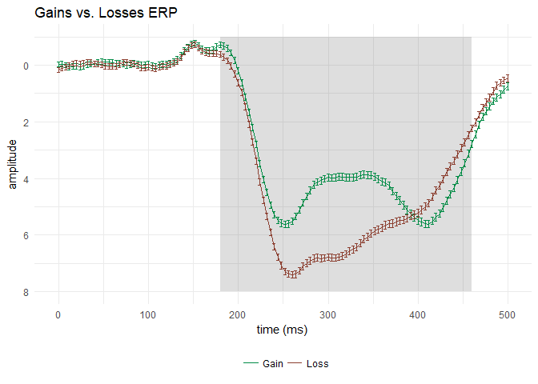
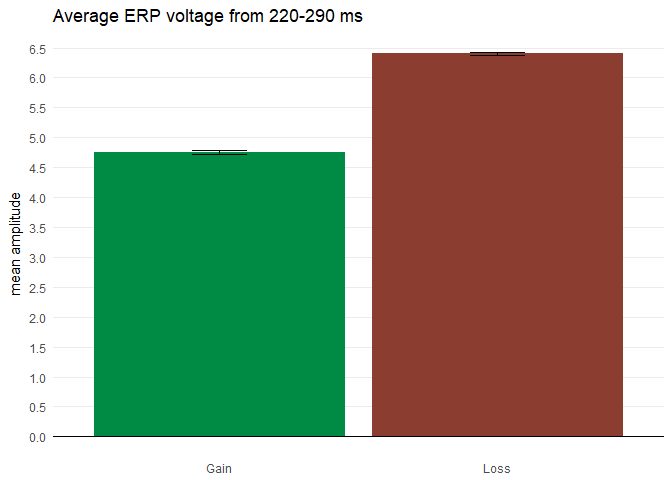
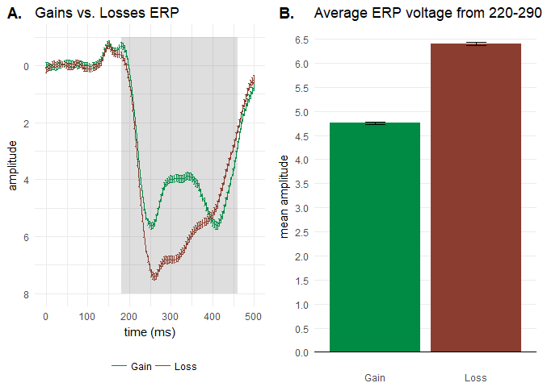

# Data Visualization in R -- Solutions
Rob Chavez (with code from others)  
5/2/2018  

Hey everyone. 

Looks like most people had a good handle on this one. This time, I've borrowed code from some of your classmate's examples that I liked. Credit is given were applicable.


# Minihacks

## Minihack 1: Creating ERPs from raw EEG data 

Event-related potentials (ERPs) are the result of averaging many trials of raw EEG, where each trial represents raw EEG time-locked to some event. Essentially, ERPs represent the relatively consistent signal amongst all the noise. Here's some data from subjects who performed a gambling task. The GainLoss variable represents when their gamble resulted in a loss (GainLoss == 0) or a gain (Gainloss == 1). For this minihack, you will need to:
* Load the cowplot library
* Read in the sample EEG
* Wrangle the data so you can plot the averaged data over each timepoint for both GainLoss conditions
* Include the standard error around the resulting ERPs
* Flip the Y axis (negative is up, old-school style)
* Pick some new colors (any colors) for the GainLoss condition and implement these in your aes call
* Annotate (using a rect) the time period where you see the condition-related effect
* Save the plot to a plot object and view it manually

**This code was taken from Heather and slighly modified with my personal aethetic preferences. Critically, Stephanie plotted the true standard error accross each point rather than relying on geom_smooth() which is not quite the same.**

```r
library(dplyr)
```

```
## 
## Attaching package: 'dplyr'
```

```
## The following objects are masked from 'package:stats':
## 
##     filter, lag
```

```
## The following objects are masked from 'package:base':
## 
##     intersect, setdiff, setequal, union
```

```r
library(ggplot2)

# load data and wrangle
eegdata <- read.csv("sample_eeg.csv", header = TRUE)

eegdata$ID <- factor(eegdata$ID)

eegdata$GainLoss <- factor(eegdata$GainLoss)


# define colors
mycolors <- c("springgreen4", "coral4")

# group and summerize by standard error
eegGLSum <- group_by(eegdata, GainLoss,  timepoint) %>% 
  summarise(mean = mean(eeg), se = sd(eeg)/(sqrt(n())))

# make labels for legend
eegGLSum$gain_loss <- ifelse(eegGLSum$GainLoss== 0, "Gain", "Loss")

# plot
lineplot <- ggplot(eegGLSum, aes(timepoint, mean, group = gain_loss, color = gain_loss)) +
  annotate("rect", xmin = 180, xmax = 460, ymin = -1, ymax = 8,
  alpha = .2) +
  geom_line() +
  geom_errorbar(aes(ymin = mean - se, ymax = mean + se)) +
  scale_color_manual(values = mycolors, name=NULL) +
  scale_y_reverse() +
  xlab("time (ms)") +
  ylab("amplitude") +
  theme_minimal() +
  theme(legend.position = 'bottom') +
  ggtitle("Gains vs. Losses ERP")

lineplot
```

<!-- -->


## Minihack 2: Creating bar plots from ERPs  

Recreate the plot from minihack 1, but this time as a bar plot of the average ERP voltage within the same time window you used to highlight the condition-related effect. This will require starting from the raw data and wrangling a little differently. Be sure to:
* Include standard error bars
* Use same colors you used in the first minihack
* Save the plot to a plot object and view it manually


**This code was taken from Taylor and slighly modified with my personal aethetic preferences in combination with the code from Heather above.**

```r
eegdata$gain_loss <- ifelse(eegdata$GainLoss== 0, "Gain", "Loss")

eeg_window <- eegdata %>% 
  filter(timepoint >= 220 & timepoint <= 290) %>% 
  group_by(gain_loss) %>% 
  summarise(mean = mean(eeg), se = sd(eeg)/sqrt(n()))

avg_plot <- ggplot(eeg_window, aes(x = gain_loss, y = mean, fill = gain_loss)) +
  geom_bar(stat = "identity") +
  geom_errorbar(aes(ymin = mean - se, ymax = mean + se), width = .2) +
  scale_fill_manual(values = mycolors) +
  theme_minimal() +
  scale_y_continuous(breaks = seq(0,8,.5)) +
  theme(panel.grid.minor=element_blank(), 
        panel.grid.major.x = element_blank(),
        legend.position="none") +
  geom_hline(yintercept = 0) +
  labs(x = NULL, y = "mean amplitude", title = "Average ERP voltage from 220-290 ms")


avg_plot
```

<!-- -->


## Minihack 3: Using Cowplot

1. Use Cowplot to:
* Stitch together your previously saved plots
* Arrange them into one row with two columns
* Align them horizontally
* Label the first plot "A", and the second plot "B"
* Save the plot to a plot object and view it manually


```r
library(cowplot)
```

```
## 
## Attaching package: 'cowplot'
```

```
## The following object is masked from 'package:ggplot2':
## 
##     ggsave
```

```r
moooo <-  plot_grid(lineplot, avg_plot, labels = c("A.", "B."))

moooo
```

<!-- -->


## Minihack 4: Get Creative

For this minihack, you will have the freedom to make your own graph from one of two readily available datasets. To get these datasets, install and load the package "reshape2". Once loaded assign the pre-loaded dataframes "french_fries" and "tips" to their own variables in your global environment. french_fries is a dataframe consisting of data collected from a sensory experiment conducted at Iowa State University in 2004. The investigators were interested in the effect of using three different fryer oils had on the taste of the fries. "tips" is a dataset where one waiter recorded information about each tip he received over a period of a few months working in one restaurant. If you want more information regarding these datasets and their variables type '?french_fries' or '?tips'. Simply make a plot that reveals something interesting in the data. Make sure to incorporate facets into your plot, make sure that it is asthetically pleasing, and make sure the graph matches the data you're trying to depict. Be creative and have fun!


```r
# load data
tips <- reshape2::tips

# calulate variables
tips <- tips %>% mutate(tip_perc = tip/total_bill)

tips_facet <- tips %>%  
  group_by(sex,day,time) %>% 
  summarise(tip_percs = mean(tip_perc), se = (sd(tip_perc/sqrt(length(tip_perc)))))

tips_facet$day <- factor(tips_facet$day, levels = c("Thur", "Fri", "Sat", "Sun"))
tips_facet$time <- factor(tips_facet$time, levels = c("Lunch", "Dinner"))

# plot
ggplot(tips_facet, aes(sex, tip_percs, fill = sex)) + 
  geom_bar(stat = "identity") +
  geom_errorbar(aes(ymin = tip_percs - se, ymax = tip_percs + se), width =.2) +
  scale_fill_manual(values = c("plum", "orchid4")) +  
  facet_grid(time~day) +
  theme(legend.position = 'none') +
  labs(x = NULL, y = "average tip percentage", title= "Sex Differences in Tip Earnings")
```

```
## Warning: Removed 1 rows containing missing values (geom_errorbar).
```

<!-- -->


~~~~~~~~~~~~~~~~~~~~~~~~~~~~~~~~

# Resources

-[Hadley Wickham's Data Visualization Guide](http://r4ds.had.co.nz/data-visualisation.html)

-[Data Visualization Cheatsheet](https://github.com/rstudio/cheatsheets/raw/master/data-visualization-2.1.pdf)

-[Rose's RColorBrewer Guide](https://blogs.uoregon.edu/rclub/2015/02/17/picking-pretty-plot-palates/)

-[Fill vs. Color](http://ggplot2.tidyverse.org/reference/aes_colour_fill_alpha.html)

-[ggplot Extensions](https://www.ggplot2-exts.org/ggiraph.html)

-[ggplot Cookbook](http://www.cookbook-r.com/Graphs/)

-[Style Guide for Figures](http://socviz.co/lookatdata.html#what-makes-bad-figures-bad)

-[Using Map Data](https://cran.r-project.org/web/packages/usmap/vignettes/mapping.html)

