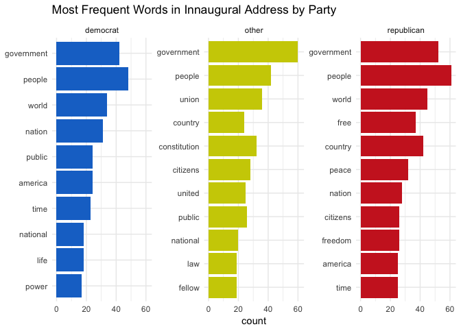

# Text Processing Hack - Solutions
Rob Chavez  
May 9, 2018  


```r
library(tidytext)
library(tidyverse)
library(stringr)
library(ggplot2)
library(wordcloud)
library(reshape2)

# Set working directory
dir <- "~/Google Drive/Teaching/PSY_607_data_science/psy607_datascience_git/Week5_text_processing/"
setwd(dir)
```

#Minihacks

##Minihack 1: Tokenize & Remove Stop-Words

The minihacks will use the presidents data file which contains the inaugural address for 17 US presidents along with their name, political party affiliation (Democrat, Republican, Other), and date of inaugural address. 


```r
#Read in the presidents data file 

prez <- read_csv("presidents.csv")
```

```
## Warning: Missing column names filled in: 'X1' [1]
```

```
## Parsed with column specification:
## cols(
##   X1 = col_integer(),
##   Name = col_character(),
##   `Inaugural Address` = col_character(),
##   Date = col_character(),
##   party = col_character(),
##   speech = col_character()
## )
```

```r
#Check data structure to make sure speech column is character and the party column is factor 
apply(prez,2, class) 
```

```
##                X1              Name Inaugural Address              Date 
##       "character"       "character"       "character"       "character" 
##             party            speech 
##       "character"       "character"
```

```r
prez$party <- as.factor(prez$party)

#There are some white space in the inaugural speech. Trim the white space in the speech column (use str_squish to trim whitespace inside a string; str_trim only trims start and end of a string)
prez <- prez %>% mutate(speech = str_squish(speech))


#Convert the speech data into Tidy Data format, one-token-per-document-per-row   
prez_token <- unnest_tokens(prez, word, speech)

#print the head of the unnested data
head(prez_token)
```

```
## # A tibble: 6 x 6
##      X1 Name              `Inaugural Address`     Date         party word 
##   <int> <chr>             <chr>                   <chr>        <fct> <chr>
## 1     4 George Washington First Inaugural Address Thursday, A… other fell…
## 2     4 George Washington First Inaugural Address Thursday, A… other citi…
## 3     4 George Washington First Inaugural Address Thursday, A… other of   
## 4     4 George Washington First Inaugural Address Thursday, A… other the  
## 5     4 George Washington First Inaugural Address Thursday, A… other sena…
## 6     4 George Washington First Inaugural Address Thursday, A… other and
```

```r
#Count the most common words and notice that prior to removing stop-words, the most common words are things like "the", "a", etc... 
prez_token %>% count(word, sort = TRUE)
```

```
## # A tibble: 4,924 x 2
##    word      n
##    <chr> <int>
##  1 the    2519
##  2 of     1726
##  3 and    1375
##  4 to     1208
##  5 in      738
##  6 our     618
##  7 a       578
##  8 we      494
##  9 that    462
## 10 be      429
## # ... with 4,914 more rows
```

```r
#Remove the stop-words in our speech data, notice the decrease in number of rows.
prez_nostops <- prez_token %>% 
  anti_join(stop_words)
```

```
## Joining, by = "word"
```

```r
#After removing stop words, now use count to find most common words in the inaugural data
prez_nostops %>% count(word, sort = TRUE)
```

```
## # A tibble: 4,442 x 2
##    word           n
##    <chr>      <int>
##  1 government   154
##  2 people       151
##  3 0097         126
##  4 world         85
##  5 country       76
##  6 public        73
##  7 nation        69
##  8 citizens      67
##  9 time          60
## 10 peace         58
## # ... with 4,432 more rows
```

```r
#What's up with the string 0097? It may have something to do with the way the speeches were coded (U+0097 in Unicode Character refers to 'END OF GUARDED AREA'). So let's remove "0097" from our analysis by creating a custom stop-word for "0097" and apply this to the data.

  # This uses a custom stop word. However, this leaves the other numbers in there.
stop_words_extra <- bind_rows(data_frame(word = c("0097"), lexicon = c("custom")), stop_words)

prez_nostops_customstop <- prez_nostops %>% anti_join(stop_words_extra)
```

```
## Joining, by = "word"
```

```r
  # This get filters out all numbers. 
prez_nostops_filtered <- prez_nostops %>% filter(word %in% str_subset(prez_nostops$word, "\\D"))

#now lets see the top words again and make sure "0097" is not present anymore.
prez_nostops_customstop %>%
  count(word, sort = TRUE)
```

```
## # A tibble: 4,441 x 2
##    word           n
##    <chr>      <int>
##  1 government   154
##  2 people       151
##  3 world         85
##  4 country       76
##  5 public        73
##  6 nation        69
##  7 citizens      67
##  8 time          60
##  9 peace         58
## 10 free          55
## # ... with 4,431 more rows
```

```r
prez_nostops_filtered %>%
  count(word, sort = TRUE)
```

```
## # A tibble: 4,437 x 2
##    word           n
##    <chr>      <int>
##  1 government   154
##  2 people       151
##  3 world         85
##  4 country       76
##  5 public        73
##  6 nation        69
##  7 citizens      67
##  8 time          60
##  9 peace         58
## 10 free          55
## # ... with 4,427 more rows
```

##Minihack 2: Visualize the Most Commonly Used Words by Political Party

Use ggplot2 to create a facet-wrapped horizontal (rather than the usual vertical) bar graph that represents the most commonly used words (n > 10) in the inaugural speech from each political party. Remove the label for the X axis. 

** This is the plot that I came up with.**

```r
colors <- c("dodgerblue3","yellow3", "firebrick3")
  
  # wrangle
prez_nostops_filtered %>%
  group_by(party) %>% 
  count(word) %>% 
  top_n(10,n) %>%
  ungroup() %>%
  mutate(word = reorder(word, n)) %>%
  # plot
  ggplot(aes(x = word, y = n, fill=party)) + 
  geom_col(show.legend = FALSE) +
  scale_fill_manual(values = colors) +
  facet_wrap(~party) +
  labs(title = "Most Frequent Words in Innaugural Address by Party",
       x = NULL, y = 'count') + theme_minimal() +
  coord_flip()
```

<!-- -->


** This is a better plot with modified code from Stephan. **

```r
prez_nostops_filtered %>%
  group_by(party) %>% 
  count(word) %>% 
  top_n(10,n) %>%
  ungroup() %>%
  mutate(word = reorder(word, n)) %>%
  # plot
  ggplot(aes(x = word, y = n, fill=party)) + 
  geom_col(show.legend = FALSE) +
  scale_fill_manual(values = colors) +
  facet_wrap(~party, scales = 'free_y') +
  labs(title = "Most Frequent Words in Innaugural Address by Party",
       x = NULL, y = 'count') + theme_minimal() +
  coord_flip()
```

<!-- -->

##Minihack 3: Create a Wordcloud

Create a wordcloud for a political party or president of your choice.  


```r
# set colors
reds <- RColorBrewer::brewer.pal(5,'Purples')

# set random set to get the same plot everytime.
set.seed(2) 

# plot
prez_nostops_filtered %>% 
  filter(Name == "Richard Milhous Nixon") %>% 
  count(word) %>%
  with(wordcloud(word, n, min.freq=2, max.words = 100, colors= reds))
```

```
## Warning in wordcloud(word, n, min.freq = 2, max.words = 100, colors =
## reds): world could not be fit on page. It will not be plotted.
```

<!-- -->

##Minihack 4: Sentiment Analysis and Visualization

Part 1: Run sentiment analysis using the `bing` sentiment lexicon to compares George Washington and Barack Obama's inaugural speech. 

Part 2: Run sentiment analysis using the `nrc` lexicon and create a bar graph from the `nrc` sentiment analysis using data that takes into account each president's overall speech length (proportion rather than raw count). 

**Part 1.**

```r
#Run sentiment analysis for George Washington and Barack Obama using the bing sentiment lexicon and return the total number of positive and negative sentiments in each president's inaugural speech (some data wrangling will be required such as group_by and summarise). The bing lexicon categorizes words in a binary fashion into positive and negative categories. 

prez_nostops_filtered %>%
  filter(Name == "George Washington") %>% 
  inner_join(get_sentiments("bing")) %>%
  count(word, sentiment, sort = TRUE) %>%
  group_by(sentiment) %>% 
  summarise(n_sentiment = n())
```

```
## Joining, by = "word"
```

```
## # A tibble: 2 x 2
##   sentiment n_sentiment
##   <chr>           <int>
## 1 negative           32
## 2 positive           67
```

```r
prez_nostops_filtered %>%
  filter(Name == "Barack Obama") %>% 
  inner_join(get_sentiments("bing")) %>%
  count(word, sentiment, sort = TRUE) %>%
  group_by(sentiment) %>% 
  summarise(n_sentiment = n())
```

```
## Joining, by = "word"
```

```
## # A tibble: 2 x 2
##   sentiment n_sentiment
##   <chr>           <int>
## 1 negative           71
## 2 positive           78
```

```r
#You may notice that while both presidents' speech has more count of positive sentiment words compared to negative sentiment words, Obama had greater overall total number of words compared to Washington (e.g., possibly an overall longer speech). This is something to take into account when conducting text analysis and something we'll do in Part 2.  
```

**Part 2.**

Now we will run sentiment analysis using the nrc sentiment lexicon and visualize our results to compare between Washington and Obama. The nrc lexicon categorizes words in a binary fashion ("yes"/"no") into categories of positive, negative, anger, anticipation, disgust, fear, joy, sadness, surprise, and trust.  

1) Run sentiment analysis for Washington and Obama using the nrc sentiment lexicon and summarise the total number of sentiments for each sentiment category (i.e., positive, negative, anger, anticipation, disgust, fear, joy, sadness, surprise, and trust) in each president's inaugural speech. 

2) After obtaining the total number of sentiments for each category for Washington and Obama , create (mutate) a new "president" column and populate the column with each respective president's name (Obama, Washington). This will be needed to bind the 2 president's data together in step 5. 

3) As mentioned earlier, Obama had greater overall total number of words compared to Washington (e.g., an overall longer speech). To take this into account in our sentiment analysis comparison, one way would be to create (mutate) a new "proportion" column that computes the number of sentiments in each category relative to the total sentiments for each president (proportion = sentiment / sum(sentiment)).  

4) Save each president's data as its own object.

5) Rbind the two presidents' data

6) Use ggplot2 to create a bar graph that shows the proportion of sentiment in Washington and Obama's inaugural speech. 

We completed the above steps for two randomly chosen presidents and this is the end visualization we are trying to achieve: 


**Note**: We have provided one way to arrive at this visualization but we know that with R, there is always more than one solution. 


```r
washington <- prez_nostops_filtered %>%
  filter(Name == "George Washington") %>% 
  inner_join(get_sentiments("nrc")) %>%
  count(word, sentiment) %>%
  group_by(sentiment) %>% 
  summarise(n_sentiment = n()) %>% 
  mutate(president = "George Washington", 
         prop = n_sentiment/sum(n_sentiment))
```

```
## Joining, by = "word"
```

```r
obama <- prez_nostops_filtered %>%
  filter(Name == "Barack Obama") %>% 
  inner_join(get_sentiments("nrc")) %>%
  count(word, sentiment) %>%
  ungroup() %>% 
  group_by(sentiment) %>% 
  summarise(n_sentiment = n()) %>% 
  mutate(president = "Barak Obama", 
         prop = n_sentiment/sum(n_sentiment))
```

```
## Joining, by = "word"
```

```r
obama_washington <- rbind(obama, washington) 

# horizontal plot
h <- ggplot(obama_washington, aes(x = reorder(sentiment,-prop), y = prop, fill = president)) +
  geom_bar(stat="identity", position=position_dodge(), color='black') +
  labs(title="Sentiment Category Analysis (horizontal)", subtitle = "Obama vs. Washington", x = NULL ,y = 'proportion') +
  theme_minimal() +
  theme(axis.text.x = element_text(angle = 45, hjust = 1), 
        plot.title = element_text(hjust = 0.5), 
        plot.subtitle = element_text(hjust=.5)) +
  geom_hline(yintercept = 0) +
  scale_fill_brewer(palette = 'Dark2') 


# vertical plot
v <- ggplot(obama_washington, aes(x = reorder(sentiment,prop), y = prop, fill = president)) +
  geom_bar(stat="identity", position=position_dodge(), color='black') +
  labs(title="Sentiment Category Analysis (vertical)", subtitle = "Obama vs. Washington", x = NULL, y = 'proportion') +
  theme_minimal() +
  geom_hline(yintercept = 0) +
  scale_fill_brewer(palette = 'Dark2') +
  coord_flip()

cowplot::plot_grid(h,v, ncol = 1)
```

<!-- -->
