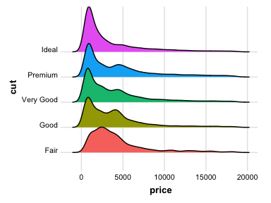

# Syllabus: PSY 607 Data Science Methods for Psychology
Rob Chavez, PhD - Assistant Professor of Psychology  
Spring 2018:  Thursdays 11:30am -- 1:20pm in Straub 257  

Welcome to our seminar! The goal of this course is to introduce you to concepts and workflows that are commonplace in "data science" more generally but are less formally discussed in Psychology. 

It is often noted that the bulk of a data scientist's time (supposedly up to 80%) is devoted to simply getting data into a format where it can finally be analyzed, rather than performing any of the substantive analyses themselves. I'm sure many of you have received a dataset that was in a format that didn't make it easy to analyze and forced you to struggle to deal with it before you could ask any questions of the data. The aim of this course is help refine your skills in these domains, such that you are ready to programmatically and reproducibly tackle any dataset that comes your way, regardless of how messy it is on arrival. It also my hope that this will help you design your studies to avoid many of these issues from outset. Additionally, we will cover topics that highlight different kinds of methods data scientists use to make sense of their data. As such, we will cover topics such as data structuring and programming, data wrangling, visualization, intro to machine learning methods, and more. 

Unlike more traditional seminars, this course will consist of a series of weekly 'mini-hackathons' in which students will rotate in leading small projects aimed at diving into a topic in these areas. Though the techniques taught in the class could be applied in many other computing languages (e.g. Python, Matlab), this course will be taught using R with RStudio. As such, this course should be well suited for students of all psychology sub-disciplines hoping to expand their understanding of R beyond basic statistical procedures to include the skills discussed above as well as more general coding and programming skills. The best way to learn these principles is to dive in deeply with hands on interactivity with practical tools you can employ in your own studies. Where possible, I will encourage people to work with real datasets to elucidate the underlying constructs. However, it should be made clear that this is not intended to be a statistics course and we will not be going into detail about topics more pertinent to a formal statistical modeling course.

## Assignments and Grading
You grade will be a weighted average of the following criteria:

* 70% -- Topic presentation and hackathon leader
* 30% -- Attendance, participation, and project submissions

### Topic presentation and hackathon leader
Your primary assignment for the course is to lead a hackathon project that highlights the topic of that week. This will involve working with a partner to come up with a small project that your classmates will work on during class and complete at home if necessary and give a short presentation about your topic. 

The hackathon projects should focus on highlighting various aspects of the weekly topic as much as possible and require a *moderate* amount of work to complete (not too much, not too little). You and your partner will also be expected to give a presentation at the beginning of class to give a short overview and tutorial about your topic, as well as set up what your hackathon project will be. These presentations should be no more than 25 minutes but no less than 10 in order to allow your classmates time to work on the hackathon project. You will be evaluated on effort and the quality of the project ideas, as well as the clarity of your presentation and helpfulness during the hackathon. I will also be asking you to give feedback on your partner's contributions to ensure everyone is contributing to these efforts equally. 

***Note:*** You and your partner need to discuss with me the idea for your project by the end of the day on the Monday prior to your presentation. This is just to ensure that I think your project is on track and feasible so everything runs as smoothly as possible the day you present. 

### Attendance, participation, and project submissions
If you are not the hackathon leader that week, your assignment will be to participate in the hackathon for the weekly project. Additionally you will be required to submit this work on Canvas in the form of ***BOTH*** an [Rmarkdown](https://rmarkdown.rstudio.com/) document (.Rmd file) that that I can use to reproduce your results and its corresponding formatted HTML file that was 'knit' from RStudio. You will be evaluated on your completeness of the project and informative documentation of your code (but not on the 'beauty' or formatting of the code itself).

***Note:*** You must submit your results to me by Tuesday night of the following week.  

## Text and Materials
There is no official textbook for this course. However, there are several resources that people may find helpful when coming up with projects to present or trying to generate code for a problem. Here are some links to some that I have found useful over the years.

#### eBooks (free!)
[R for Data Science](http://r4ds.had.co.nz) \
[Advanced R](http://adv-r.had.co.nz) \
[An Introduction to Statistical Learning](http://www-bcf.usc.edu/~gareth/ISL) 

#### Other books (not free)
[The Art of R Programming](https://www.amazon.com/Art-Programming-Statistical-Software-Design/dp/1593273843) \
[Applied Predictive Modeling](http://appliedpredictivemodeling.com) 

#### Helpful online resources
[Cheat Sheets](https://www.rstudio.com/resources/cheatsheets) \
[Cookbook for R](http://www.cookbook-r.com) \
[Quick-R](https://www.statmethods.net) 

#### Online forums
[Stack Overflow](https://stackoverflow.com) \
[Cross Validated](https://stats.stackexchange.com)

## Classroom Expectations
*Because of the hackathon style of the course, it is required that you bring your laptop and charger to every class.* 

As always, you are expected to treat your peers, instructor, and everyone else with respect. Although you are expected to produce you own work, it is understandable some parts of your code may have originated elsewhere and that is fine. However, if there is any indication that you are simply copying and pasting bits and pieces of other's work without an earnest effort to produce original work, it will be grounds for academic misconduct. 

### Absences
If you are going to be absent for any reason, please notify me ASAP. You will still be responsible for submitting you hackathon project for that week.

### Prohibited Discrimination and Harassment Reporting
Any student who has experienced sexual assault, relationship violence, sex or gender-based bullying, stalking, and/or sexual harassment may seek resources and help at safe.uoregon.edu.  To get help by phone, a student can also call either the UO’s 24-hour hotline at 541-346-7244 [SAFE], or the non-confidential Title IX Coordinator at 541-346-8136. From the SAFE website, students may also connect to Callisto, a confidential, third-party reporting site that is not a part of the university.

Students experiencing any other form of prohibited discrimination or harassment can find information at respect.uoregon.edu or aaeo.uoregon.edu or contact the non-confidential AAEO office at 541-346-3123 or the Dean of Students Office at 541-346-3216 for help. As UO policy has different reporting requirements based on the nature of the reported harassment or discrimination, additional information about reporting requirements for discrimination or harassment unrelated to sexual assault, relationship violence, sex or gender based bullying, stalking, and/or sexual harassment is available at http:// http://aaeo.uoregon.edu/content/discrimination-harassment.

Specific details about confidentiality of information and reporting obligations of employees can be found at https://titleix.uoregon.edu. 

Mandatory Reporting of Child Abuse: UO employees, including faculty, staff, and GEs, are mandatory reporters of child abuse. This statement is to advise you that that your disclosure of information about child abuse to a UO employee may trigger the UO employee’s duty to report that information to the designated authorities. Please refer to the following links for detailed information about mandatory reporting: https://hr.uoregon.edu/policies-leaves/general-information/mandatory-reporting-child-abuse-and-neglect/presidents-message

## Changes to the Syllabus
I reserve the right to change or waive any part of this syllabus at any time.

## Schedule 

| Week/Date     | Topic                    | Presenters         |
| ------------- | ------------------------ | ------------------ |
| 1 -- April 5  | Intro and logistics      |  Rob               |
| 2 -- April 12 | General programming in R |  Krista & Brenden  |
| 3 -- April 19 | Data munging/wrangling   |  Bradely & Sarah   |
| 4 -- April 26 | Data visualization       |  Pablo & Adam      |
| 5 -- May 3    | Text processing          |  Stephanie & Pooya |
| 6 -- May 10   | Web scraping             |  Stephan & Taylor  |
| 7 -- May 17   | Machine Learning         |  Sara & Stefania   |
| 8 -- May 24   | Network analysis         |  Cory & Heather    |
| 9 -- May 31   | Package creation         |  Lea & Ashley      |
| 10 -- June 6  | Advanced Programming     |  Sam & Dani        |

